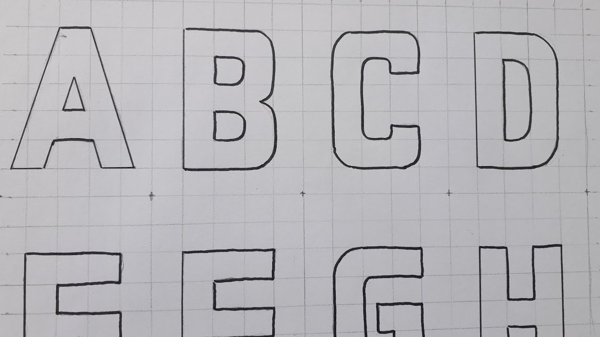
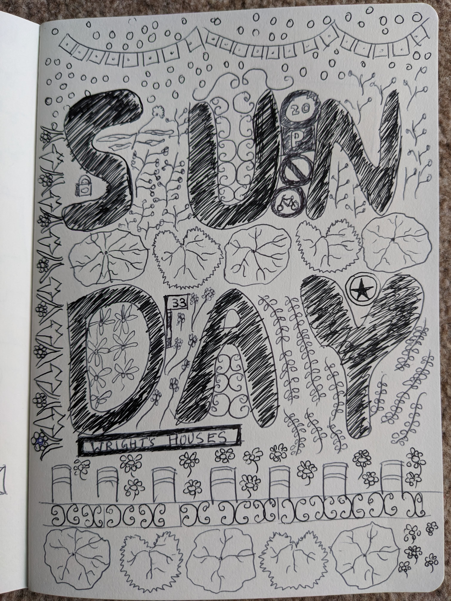

Drawing was a big part of my childhood. I wasn't very good, but I liked drawing things that I used to see in comic books. In fact for a long time -- even into adulthood -- I really wanted to be able to draw a comic. There were others who were able to draw better. I had friends who used to draw with straight confident lines, beautifully articulated fingers, realistic duplicates of cartoons. But I appreciated their drawings, and enjoyed doing my own. Drawing doodles for my own sake was a completely safe space to express myself -- though as a kid I never realized that or had those words. But I completely stopped doodling around the 9th grade.

As part of 9th grade everyone had to pick an _elective_ subject [^1]. Most boys wanted to either take Electronics or Yoga because the _Sirs_ [^2] would take the kids to play games in the field rather than teach the subject. Unfortunately, there was limited capacity in either of those, so students had to fill out a ranking of what subject they would take if the first choices weren't available. Yoga and Electronics were my top choices, and as my last choice I decided to put _Commercial Art_, which I thought was a drawing class since it had the word "Art" in it.

Well turns out, _Commercial Art_ wasn't really the kind of drawing that I did.

In the first class the teacher asked us to make a 6x6 grid by hand, with pencil, and then draw the alphabet in each 6x6 grid. Something like this, but imagine the grid was also drawn by hand.

We were then required to shade the alphabets. It was a pointless exercise. I remember being jealous of all my friends who had taken Yoga/Electronics, and were out playing cricket or basketball in the field while I was sitting on the floor trying to draw a "B" that fit correctly in the grid.

It took multiple classes to finish, but I finally had the alphabets drawn. The first exercise was done. I was hoping for something more interesting next. Maybe I will get to draw cartoons?

Well, no. The next exercise was to draw a vase which was in front of a curtain. We had to capture the vase in its 3D representation, the shadow the vase was casting, and the flowing cloth of the curtain. Of all the things that I could have drawn at that time, a vase was probably the most boring one that could have been picked. I had never done anything like this before, and the _Ma'am_ didn't explain how to draw it either. We were given a photo and were asked to replicate it. That's it.

I was a good student, so I finished the assignment to the best of my ability. But when my work was evaluated by the teacher. She was quite unimpressed. I don't remember what she said, but they weren't kind words.

It was around that time that I stopped drawing. The _Commercial Art_ class incident influenced me. But also, I considered myself a grown-up and relegated drawing to something that's associated with kids.

Since then drawing has always been in the background, as something that I wanted to pick up again. But I never really got down to it. I once picked up "Drawing on the right side of the brain", but never really got past the first exercise where she asks you to draw a self-portrait and your hands. I also tried the drawabox.com course, I went past some assignments but didn't really get to draw anything of my own.

-------

Now we come to the present time in Edinburgh. 2 weeks ago, after grabbing a coffee from [Modern Standard Coffee](https://modernstandardcoffee.co.uk/), I did something that most people like to do these days. I opened my phone and started clicking on things aimlessly. I opened Google Maps, perhaps to check out if there was a Thai Chi place nearby, but instead clicked on the Modern Standard Coffee shop. And Maps said that there was a ["Let's Draw Something Fun"](https://www.eventbrite.co.uk/e/lets-draw-something-fun-tickets-403964969097) event happening soon on a *Sunday*. I was curious, and I signed up.

I loved the class. Without going into the details of what we did, this is what I drew:

The class gave back something that I feel was taken from me -- the confidence that I knew that I can draw. It may not be the best, but it is mine. 

And at the end of the day, the essesnce of art is having the courage to express yourself.

[^1]: It was actually called [SUPW](https://en.wikipedia.org/wiki/Socially_Useful_Productive_Work) which stood for "Socially Useful Productive Work". But us students called it "Some Useful Period Wasted".
[^2]: Male teachers were called "Sir". Female ones were called "Ma'am".

